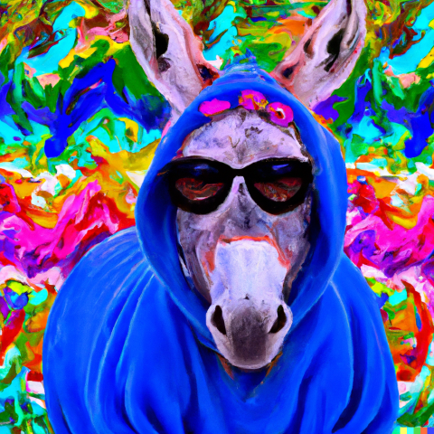
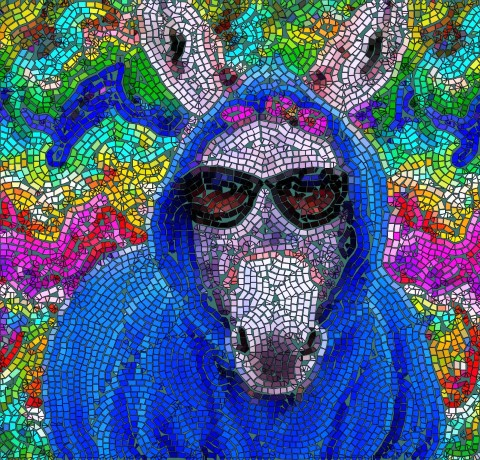

# Mosaic Image Generator

This repository contains Python code to convert any image into an artistic mosaic representation. It is based on previous work from [yobeatz](https://github.com/yobeatz/mosaic).

|     **Original Image**     |     **Generated Mosaic**     |
| :------------------------: | :--------------------------: |
|    |    |

## Implementation Details

The project uses the following steps to convert an image into a mosaic:
1. Read and process and image.
2. Extract the edges of the image using AI or classical edge extraction methods.
4. Derive guidelines to place polygons that will serve as the tiles of the mosaic.
5. Apply color for each tile based on the original image.
6. Plot and save the mosaic.

## Usage

To use this project, simply run the `main.py` script adjusting the `config_parameters`:
- Provide the path to the input image and a desired output folder.
- Define the desired tile size for the mosaic.
- Define the method of edge extraction (HED, diblasi, sobel)
- Define the coloring method (Original colors, k-means clustered colors)
- Whether to resize the image or not (if the image is too big).

## Requirements

Check the [`requirements`](requirements.txt) file.

## Contributions

Contributions are welcome! If you find a bug or have an idea for a new feature, please open an issue or submit a pull request.

## License

This project is licensed under the [MIT License](LICENSE).
